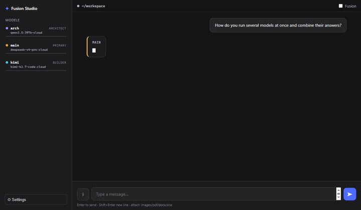

# Fusion Studio

A local, self-hosted **multi-model fusion studio**: a chat app (web + desktop) that runs
**several models at the same time** on one task and fuses their answers — *AND, not OR*.

Built on top of:
- **[pi](https://pi.dev/)** (the coding agent) as the agent engine
- **[Ollama](https://ollama.com/)** as the model backend — **no cloud API keys required**
- the multi-model **fusion** concept from **[fusion-harness](https://github.com/disler/fusion-harness)**
- visual identity + layout borrowed from **[DeepSeek Harness](https://github.com/deepseek-ai/deepseek-harness)**

[](https://github.com/morlocul/fusion-studio)
[](LICENSE)
[](https://github.com/morlocul/fusion-studio/actions/workflows/build.yml)
[](https://ollama.com)

> **Fusion Studio is not DeepSeek Harness.** DeepSeek Harness runs **one agent** that does the whole job.
> Fusion Studio runs **2–5 models in parallel** on the same problem and merges their answers.

---

## Features

- **Main chat** — a conversation with your primary model (DeepSeek V4 Pro via Ollama), with session memory.
- **Fusion mode** — runs every configured slot **in parallel** (read-only), then a final **merge** by the architect.
- **Multiple providers** — pick models from any provider pi can see:
  - **Ollama** (local **or** Ollama Cloud via `:cloud`) — no keys needed
  - **OpenAI / Anthropic / Gemini / Groq / Mistral / OpenRouter** — paste your **API key** in Settings (⚙); the provider's models appear immediately (no extra window, no browser login)
- **File attachments** — attach images, PDF, DOCX, XLSX, TXT:
  - images → sent **directly to a vision model** (e.g. local `qwen3.8:27b-128k`)
  - pdf/docx/xlsx → text extracted and injected into the prompt
- **Agentic** — the agent has tools (read / bash / edit / write) and works in a local `workspace/` folder.
- **Settings UI** — pick models, roles, vision model and Ollama host from the GUI (⚙), no config edits needed.
- **Web and desktop** — run it in the browser, or as a standalone Electron window.

## Demo



---

## Requirements

- [Node.js](https://nodejs.org/) 20+
- [pi](https://pi.dev/) installed globally:
  ```bash
  npm install -g @earendil-works/pi-coding-agent
  ```
- [Ollama](https://ollama.com/) running on `http://localhost:11434` (local models or Ollama Cloud)

## Install

```bash
git clone <your-repo-url>
cd fusion-studio
npm install
```

## Run

### Desktop app (standalone window, no browser)

```
dist\FusionStudio-win32-x64\FusionStudio.exe
```

Rebuild after code changes:

```bash
npm run dist
```

### Web (browser)

```bash
npm start
# open http://127.0.0.1:3090
```

### Dev window (Electron)

```bash
npm run desktop
```

### CLI (thin client of the local server)

```
node cli.js chat   "how do I X?"        # talk to the Main model
node cli.js fusion "compare X and Y"    # run all slots in parallel + merge
node cli.js models                      # list available models
node cli.js config                      # show current settings
node cli.js login anthropic sk-ant-...  # save an API key
```

Install globally to get a `fusion` command: `npm link`.

---

## Usage

- Type a message → **Enter** to send (chat goes to the **Main** model).
- Toggle **Fusion** in the top bar to run all slots in parallel (optionally with a final **merge**).
- **📎** to attach files (images / pdf / docx / xlsx / txt).
- **⚙ Settings** (or the sidebar) to choose which model each slot uses.

### Fusion flow

1. Every configured slot researches the prompt **read-only**, in parallel.
2. Vision-capable slots see attached images directly; non-vision slots get a vision description.
3. (Optional) the **architect** merges all opinions into one final answer.

## Configuration

On first run, copy the example config (then edit it or use the in-app **⚙ Settings**):

```bash
copy server\config.example.json server\config.json
```

Edit `server/config.json`:

```jsonc
{
  "port": 3090,
  "ollamaHost": "http://localhost:11434",
  "imageModel": "ollama/qwen3.8:27b-128k",   // vision model for image attachments
  "slots": [
    { "name": "arch", "model": "ollama/qwen3.5:397b-cloud",   "role": "architect", "vision": true },
    { "name": "main", "model": "ollama/deepseek-v4-pro:cloud", "role": "primary",   "vision": false },
    { "name": "kimi", "model": "ollama/kimi-k2.7-code:cloud",  "role": "builder",   "vision": true }
  ]
}
```

- `role: "primary"` → the Main chat model
- `role: "architect"` → merges opinions in fusion mode
- exactly one architect + one primary, 2–5 slots total
- vision-capable models (e.g. `qwen3.8:27b-128k`, `gemma4:12b`, `minimax-m3:cloud`) see images directly

Optional fields:
- `piCli` — absolute path to pi's `dist/bundle/cli.js`. If empty, the app runs `pi` from your PATH.
- `modelsJson` — absolute path to pi's `~/.pi/agent/models.json` (used to read vision/context metadata and update the Ollama host). If empty, model metadata comes straight from Ollama.

## Project structure

```
fusion-studio/
├─ server/            # Express backend + pi runner + file extraction
│  ├─ index.js        # /api/chat, /api/fusion, /api/settings, /api/models
│  ├─ pi.js           # spawns pi (node cli.js) non-interactively
│  ├─ extract.js      # pdf/docx/xlsx/txt extraction + image detection
│  ├─ ollama.js       # model listing + models.json helpers
│  └─ config.json     # slots, models, host
├─ public/            # web UI (index.html, app.js, style.css)
├─ desktop/main.js    # Electron shell
├─ scripts/fix-bundle.js  # repairs node_modules after packaging
├─ workspace/         # the agent's working folder
└─ dist/              # packaged desktop app (FusionStudio.exe)
```

## Tech stack

- **Express** — HTTP/SSE server
- **pi** — agentic coding engine (sub-processed per request)
- **Ollama** — local/cloud model backend
- **pdfjs-dist / mammoth / xlsx** — file text extraction
- **Electron** — desktop wrapper

## License & Attribution

**Fusion Studio** is licensed under the [MIT License](LICENSE).

It builds on the **fusion concept** from
[fusion-harness](https://github.com/disler/fusion-harness) (MIT, © 2026 IndyDevDan)
and the **visual identity / layout** of
[DeepSeek Harness](https://github.com/deepseek-ai/deepseek-harness) (MIT, © 2026 DeepSeek).
Both are MIT-licensed; see [`NOTICE.md`](NOTICE.md) for the full third-party notices
and copyright lines. Fusion Studio is an original implementation — no substantial
code was copied from these projects.
